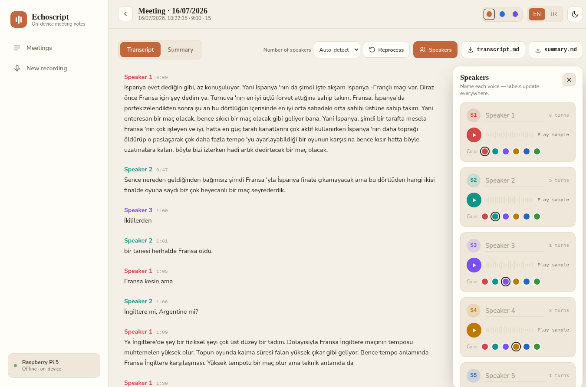

# Local Audio Notes

A fully **local, offline** audio pipeline. It turns a recording (or live mic input) into a
speaker-labeled `transcript.md` and an LLM-generated `summary.md`. No audio or text ever
leaves the device — everything runs on-CPU and is sized to fit a Raspberry Pi 5 (8 GB).

## Web UI

  


## Data flow

```
audio file  ──►  ingest  ──►  preprocess  ──►  diarize ──┐
(.wav/.mp3/…)                                            ├─► merge ──► transcript.md
                           ──►  transcribe ─────────────┘│
                                                                         └─► summarize ──► summary.md
```

| Stage | Module | In → Out | What it does |
|---|---|---|---|
| **Ingest** | `src/ingest.py` | file → `AudioData` | Loads/decodes audio into a channels-first float32 array. |
| **Preprocess** | `src/preprocess.py` | `AudioData` → `AudioData` | Converts to 16 kHz, mono, peak-normalized — the format both models expect. |
| **Diarize** | `src/diarize.py` | `AudioData` → `list[SpeakerTurn]` | *Who* spoke *when* (start/end/speaker) via `sherpa-onnx`. |
| **Transcribe** | `src/transcribe.py` | `AudioData` → `Transcript` | *What* was said, with per-word timestamps via `faster-whisper` (int8). |
| **Merge** | `src/merge.py` | turns + transcript → `list[Utterance]` | Assigns each word to a speaker by timestamp overlap, then renders `transcript.md`. |
| **Summarize** | `src/summarize.py` | transcript text → `summary.md` | Overview + key points + decisions + action items via a local Qwen GGUF LLM (`llama.cpp`). |

Stages run **sequentially**: each model is loaded, used, then freed (`gc`) before the next
loads — the Pi cannot hold them all in memory at once.

**Core types:** `AudioData` (samples `[channels, samples]`, sample_rate, source_path),
`SpeakerTurn` (start, end, speaker), `Transcript` (segments → words), `Utterance` (speaker, start, end, text).

## Usage

```bash
source venv/bin/activate       # run all commands from the project root
pip install -r requirements.txt
```

`main.py` is a FastAPI server. The browser streams 16 kHz mono int16 PCM over
`WS /ws/audio`; a WebRTC-VAD segmenter cuts it into utterances, each queued as a job and
run through the full pipeline. Poll results at `GET /jobs` and `GET /jobs/{job_id}`.

```bash
uvicorn main:app --host 0.0.0.0 --port 8000
```

## Models

Not committed — place under `models/`:

- `models/sherpa-onnx-pyannote-segmentation-3-0/model.onnx` — segmentation
- `models/3dspeaker_speech_eres2net_base_sv_zh-cn_3dspeaker_16k.onnx` — speaker embeddings
- a Qwen GGUF (e.g. `Qwen2.5-3B-Instruct` Q4_K_M) for summarization

Whisper weights are downloaded on first run by `faster-whisper`.
