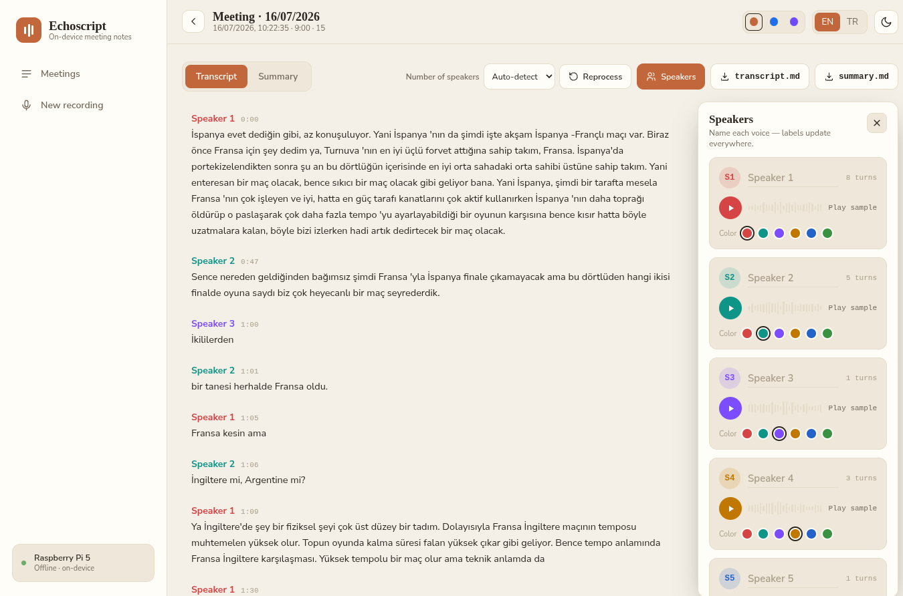

# Local Audio Notes

## Quick start

From the project folder, start the server (first-time setup is under [Usage](#usage)):

```bash
source venv/bin/activate
uvicorn main:app --host 0.0.0.0 --port 8000
```

Wait for `Application startup complete` (the models load onto the Hailo first, which takes a
while), then open the web UI **on the Pi** in a browser:

**<http://localhost:8000>**

Do not open `frontend/Echoscript.dc.html` (or the `*-standalone.html` files) by double-clicking
it: the page only works when the server serves it. Use `localhost` rather than the Pi's IP
address, because browsers only allow microphone access on `localhost` or over HTTPS. Stop the
server with `Ctrl+C`.

---

A fully **local, offline** audio pipeline. It turns live microphone input into a
speaker-labeled `transcript.md` and an LLM-generated `summary.md`. No audio or text ever
leaves the device — **it runs on a Raspberry Pi 5 (16 GB) with a Hailo-10H AI HAT+2: Whisper and the LLM run on the HAT, VAD and diarization on the CPU.**

<h2>Web UI</h2>
  

1. **New recording** → pick the transcription language (Auto-detect, English or Türkçe) → **Record**, speak, **Stop**.
2. **Meetings** lists your recordings, newest first, moving through *Queued → Processing → Ready*.
3. Open a *Ready* row for the **Transcript** and **Summary** tabs. The **Speakers** panel renames
   and recolors voices (the transcript and summary update), and `transcript.md` / `summary.md`
   download the results.

The screenshot above shows the design; the app itself shows your real recordings.

## Data flow

Live path: browser mic → `WS /ws/audio` → VAD segmenter → one `.wav` per utterance → the
pipeline below, run once per utterance.

```
audio file  ──►  ingest  ──►  preprocess  ──►  diarize ──┐
(.wav/.mp3/…)                                            ├─► merge ──► transcript.md
                           ──►  transcribe ─────────────┘│
                                                                         └─► summarize ──► summary.md
```

| Stage | Module | In → Out | What it does |
|---|---|---|---|
| **Ingest** | `src/ingest.py` | file → `AudioData` | Loads/decodes audio into a channels-first float32 array. |
| **Preprocess** | `src/preprocess.py` | `AudioData` → `AudioData` | Converts to 16 kHz, mono, peak-normalized — the format both models expect. |
| **Diarize** | `src/diarize.py` | `AudioData` → `list[SpeakerTurn]` | *Who* spoke *when* (start/end/speaker) via `sherpa-onnx`. |
| **Transcribe** | `src/transcribe.py` | `AudioData` → `Transcript` | *What* was said, with segment timestamps via Whisper-Small on the Hailo-10H (`Speech2Text`). |
| **Merge** | `src/merge.py` | turns + transcript → `list[Utterance]` | Assigns each word (or whole segment, since Hailo gives no word timings) to a speaker by timestamp overlap, then renders `transcript.md`. |
| **Summarize** | `src/summarize.py` | transcript text → `summary.md` | Overview + key points + decisions + action items via Qwen2.5-1.5B-Instruct on the Hailo-10H (`LLM`). |

Stages run **sequentially** from one job queue. Whisper and the LLM are loaded onto the Hailo
once at startup and stay resident, sharing one `VDevice`; only the CPU diarizer is loaded and
freed per job.

**Core types:** `AudioData` (samples `[channels, samples]`, sample_rate, source_path),
`SpeakerTurn` (start, end, speaker), `Transcript` (segments; words stay empty on Hailo), `Utterance` (speaker, start, end, text).

## Local LLM Summarization

Echoscript uses **Qwen2.5-1.5B-Instruct** compiled as a Hailo `.hef`, run through
`hailo_platform.genai.LLM`. The model runs locally on the Hailo-10H, so
transcripts and summaries never leave the device.

The LLM generates:

- A meeting overview
- Key points
- Decisions
- Action items

Summarization runs automatically after transcription. The context size is fixed inside the HEF
(`llm.max_context_capacity()`), and each LLM call generates up to 600 tokens.

## Usage

### One-time setup

1. Install the Hailo-10H stack, reboot, and check that `hailortcli scan` lists the device:
   ```bash
   sudo apt install hailo-h10-all
   ```
2. Put the compiled models in `~/hailo-rpi5-examples/llm_models/` (see [Models](#models)).
3. Create the virtual environment and install the dependencies:
   ```bash
   python3 -m venv --system-site-packages venv   # so the apt-installed hailo_platform is importable
   source venv/bin/activate
   pip3 install -r requirements.txt
   ```

### Running

See [Quick start](#quick-start). Run a single worker (no `--workers`, no `--reload`): the Hailo
device is exclusive to one process, so `llm_chat.py` / `speech2text.py` cannot run while the
server is up.

### API

`main.py` is a FastAPI server:

| Endpoint | What it does |
|---|---|
| `GET /` | The web UI (`frontend/Echoscript.dc.html`, with `support.js` and `pcm-worklet.js` beside it). |
| `WS /ws/audio?lang=auto` | The browser streams 16 kHz mono int16 PCM here. A WebRTC-VAD segmenter cuts it into utterances, each queued as a job. `lang` is `en`, `tr` or `auto` (Whisper detects the language). The server replies with a `segment_captured` event per job. |
| `GET /jobs` | Every job (`id`, `status`, `seconds`, `created_at`), newest first. Status is `queued`, `processing`, `done` or `error`. |
| `GET /jobs/{job_id}` | The full job, including the transcript and summary once it is `done`. |

The VAD drops segments shorter than `min_segment_ms` in `vad.py` (2 s, which includes about
1.5 s of padding, so roughly 0.5 s of speech) to filter out clicks and coughs.

## Known limitations

- **One job per utterance, not per recording.** Each speech segment is processed on its own, so a
  recording appears as several rows, and diarization runs per segment: `Speaker 1` in one row is
  not necessarily the same person as `Speaker 1` in another.
- **Jobs are kept in memory** and are lost when the server restarts (`src/database.py` is not connected).
- **Live input only.** There is no file upload in the UI or the API.
- **No word timestamps from Whisper on Hailo**, so a segment containing two speakers gets one label.
- **The UI needs internet on first load**: it fetches React from `unpkg.com` and fonts from Google.
- Whisper language auto-detection and Turkish quality on the Hailo Whisper models are untested.
- `frontend/Echoscript-standalone.html` and `Echoscript-standalone_new.html` are exports of the
  original mock-data prototype and are not connected to the backend.

## Models

Not committed. Diarization models go under `models/`:

- `models/sherpa-onnx-pyannote-segmentation-3-0/model.onnx` — segmentation
- `models/3dspeaker_speech_eres2net_base_sv_zh-cn_3dspeaker_16k.onnx` — speaker embeddings

Compiled Hailo models live in `~/hailo-rpi5-examples/llm_models/`:

- `Whisper-Small.hef` — speech-to-text
- `Qwen2.5-1.5B-Instruct.hef` — summarization
